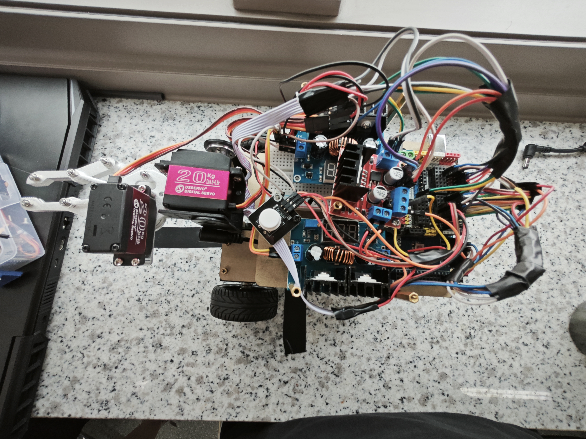

<div align="center">

# AutoCar: 自动化认知与实践课程用自动巡线小车 <!-- omit in toc -->

<b>中文</b> | <a href="/README_en.md">English</a>

</div>

## 内容 <!-- omit in toc -->

- [简介](#简介)
- [项目结构](#项目结构)
- [代码运行逻辑](#代码运行逻辑)
- [功能具体实现](#功能具体实现)
- [使用方法](#使用方法)
- [项目成果展示](#项目成果展示)

## 简介

本项目是 2022 年哈尔滨工业大学（深圳）AUTO1001 - [自动化认知与实践](https://github.com/HITSZ-OpenAuto/AUTO1001)课程考核项目：_自动巡线小车_ 的对应代码，由 [pspdada](https://github.com/pspdada) 编写，提供有需要的同学参考。

本次考核包括**竞速**和**避障**两个部分，可用不同代码完成：

- 在**竞速**部分，小车需在固定轨迹的起点使用自行设计的机械夹爪拿起一个圆柱体，后循迹到终点，途中会遇到半圆形弯道、直角转弯等复杂情况，需要灵活处理。到了终点，需要将圆柱体平稳放下。
- 在**避障**部分，只需考核小车探测障碍并作出反应的能力，避障之后要求能够回到路线上继续行驶。

对应开发板：Arduino Mega 2560

考核时间: 2023.3.19 15:00，分数: 35/35

## 项目结构

核心代码在本项目的 [`AutoCar`](/AutoCar) 文件夹下，包含以下 `.ino` 和 `.h` 文件：

- `AutoCar_def`: 宏定义项目用到的常量、引脚和数据类型等，根据实际情况修改
- `control`: 控制小车的运动，包括三个部分
  - `runMode()`: 根据红外传感器的输出来决定小车运动模式
  - `motorControl()`: 根据小车运动模式选择小车两轮的目标速度
  - `carRun()`: 根据小车两轮的目标速度来输出 PWM 波控制小车
- `ctrt`: 红外模块相关功能
  - `updateCTRTstate()`: 更新红外模块的记忆数组
- `encoder`: 编码器中断函数，用于获取电机的编码器值
- `pid`: 实现 PID 控制器算法
- `robotic_arm`: 机械臂控制相关功能
  - `servoGrab()`: 控制机械臂夹取物品
  - `servoDrop()`: 控制机械臂放下物品

## 代码运行逻辑

```c
1、上电，执行部分代码（初始化部分）后暂停
2、按下按钮后程序继续进行
3、机械臂运动，夹取物品
4、红外模块读取数据，根据这个数据确定运动的模式（如左转、直行）
5、根据运动的模式设置左右两轮的目标速度
6、根据编码器的值计算轮子当前速度
7、用pid根据目标速度、当前速度计算出输出量以驱动电机
8、当遇到障碍时，优先躲避障碍
9、当遇到终点线时，执行最后的动作，之后不再运动
```

## 功能具体实现

在考核中最复杂的一部分就是直角转弯，使用常规的控制方法都很容易冲出预定轨迹。因此我们采用了寄存器+越界检测的方式，即即使实际上安装在车头部分的红外探测模块（`ctrt`）已经无法检测到线路，我们也可以根据 `ctrt` 以前的状态来判断目前是应该左转还是右转，这样的好处是在车完全冲出预定轨迹之前就可以进行纠正，能够回到预定轨迹上。

## 使用方法

- 根据实际接线情况修改 `AutoCar_def.h` 文件中的定义
- 将代码刷入开发板

## 项目成果展示

以下是我们项目完成后的实物照片。AUTO1001 课程的这一项目，是一个具有实践价值的学习项目。我们希望通过这个项目，大家能够深入理解自动控制的相关知识，并顺利完成项目制作。

<table align="center">
    <p align="center">
      
    </p>
    <p align="center">
      
    </p>
    <p align="center">
      
    </p>
</table>
