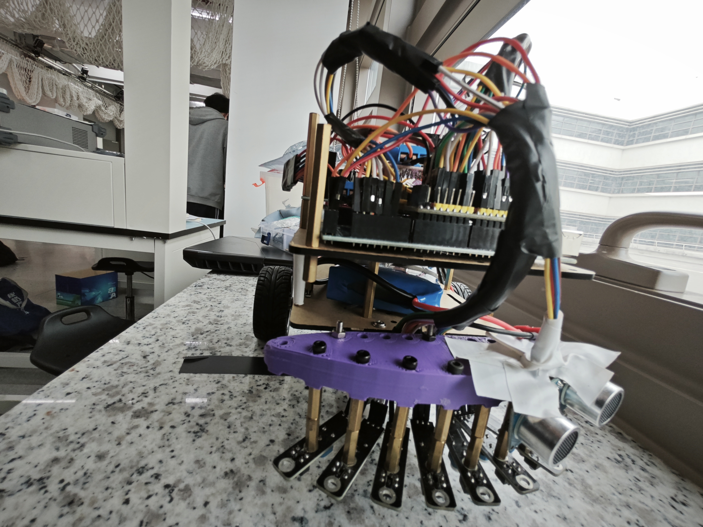
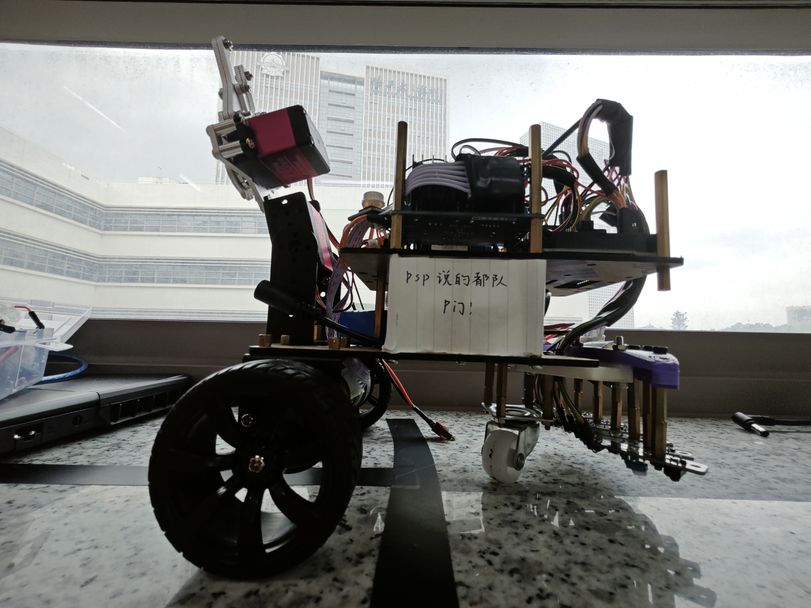

<div align="center">

# AutoCar: Automated Line-Following Car for AUTO1001 <!-- omit in toc -->

<a href="/README.md">中文</a> | <b>English</b>

</div>

## Contents <!-- omit in toc -->

- [Introduction](#introduction)
- [Project Structure](#project-structure)
- [Code Execution Logic](#code-execution-logic)
- [Detailed Implementation](#detailed-implementation)
- [Usage](#usage)
- [Project Outcome Showcase](#project-outcome-showcase)

## Introduction

This project contains the code for the 2022 Harbin Institute of Technology (Shenzhen) AUTO1001 – [Automation Cognition and Practice](https://github.com/HITSZ-OpenAuto/AUTO1001) course assessment project: _Automated Line-Following Car_, written by [pspdada](https://github.com/pspdada), provided for reference by interested students.

The assessment consists of two parts, **Speed Racing** and **Obstacle Avoidance**, which can be completed with different code:

- **Speed Racing**: The car must pick up a cylinder at the start of a fixed track using a custom-designed mechanical gripper, then follow the line to the finish. Along the way, it will encounter semicircular curves, right-angle turns, and other complex situations that require flexible handling. Upon reaching the finish line, the car must smoothly place the cylinder down.

- **Obstacle Avoidance**: This part tests the car’s ability to detect obstacles and react accordingly. After avoiding an obstacle, the car must return to the track and continue driving.

Development board: Arduino Mega 2560
Assessment date and score: March 19, 2023 15:00 – 35/35

## Project Structure

The core code is located in the [`AutoCar`](/AutoCar) folder of this project, and includes the following `.ino` and `.h` files:

- `AutoCar_def`: Defines constants, pins, and data types used in the project; modify according to your actual setup
- `control`: Controls the car's motion, consisting of three parts:
  - `runMode()`: Determines the car's motion mode based on infrared sensor input
  - `motorControl()`: Sets the target speeds for the two wheels according to the motion mode
  - `carRun()`: Outputs PWM signals to control the car based on the target wheel speeds
- `ctrt`: Infrared module-related functions
  - `updateCTRTstate()`: Updates the infrared module's memory array
- `encoder`: Encoder interrupt functions for obtaining motor encoder values
- `pid`: Implements PID controller algorithm
- `robotic_arm`: Mechanical arm control-related functions
  - `servoGrab()`: Controls the mechanical arm to grab objects
  - `servoDrop()`: Controls the mechanical arm to drop objects

## Code Execution Logic

```
1、Power on, execute initialization code, then pause
2、Press the button to resume program execution
3、Mechanical arm moves and grips the object
4、Infrared module reads data and determines the motion mode (e.g., left turn, straight)
5、Set the target speeds for the left and right wheels according to the motion mode
6、Calculate the current wheel speeds based on encoder readings
7、Use PID to compute the outputs from target and current speeds to drive the motors
8、When an obstacle is encountered, avoid it first
9、When the finish line is reached, perform the final action and then stop
```

## Detailed Implementation

The most challenging part of the assessment is the right-angle turn, which easily causes the car to leave the predefined track when using conventional control methods. Therefore, we employ a register + boundary-detection approach: even if the infrared detection module (`ctrt`) mounted at the front of the car can no longer detect the line, we can infer from its previous state whether to turn left or right. This allows us to correct the trajectory before the car completely leaves the track and returns it to the predefined path.

## Usage

- Modify the definitions in `AutoCar_def.h` according to your wiring
- Upload the code to the development board

## Project Outcome Showcase

Below are the photographs of our completed project. This project, part of the AUTO1001 course, serves as a valuable hands-on learning experience. We hope that through this project, students can gain a deeper understanding of automatic control concepts and successfully complete the project implementation.

<table align="center">
    <p align="center">
      
    </p>
    <p align="center">
      
    </p>
    <p align="center">
      
    </p>
</table>
